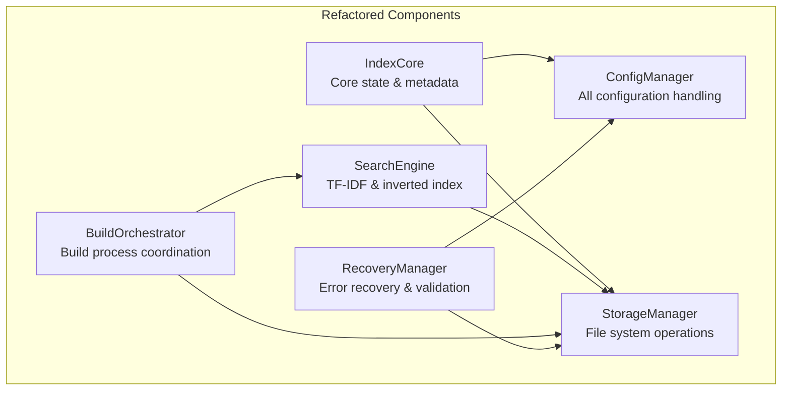

# RAGIT Index Refactoring: Towards a Modular Architecture

This document outlines a proposed refactoring of the monolithic `Index` struct in RAGIT, aiming to separate its various responsibilities into distinct, more manageable components. This modular approach will enhance maintainability, testability, and overall system clarity.

## Current Monolithic Structure

The existing `Index` struct currently encapsulates a wide range of functionalities, including:
- **State Management**: Handling version tracking, file staging, and processing status.
- **Configuration Management**: Managing build, query, and API configurations.
- **Initialization & Loading**: Implementing bootstrap and recovery logic.
- **Search Operations**: Performing TF-IDF and inverted index queries.

## Proposed Refactored Architecture

The refactoring proposes breaking down these concerns into the following specialized components:



### 1. **IndexCore** - Essential State
This component will manage the fundamental state and metadata of the index.
```rust
pub struct IndexCore {
    ragit_version: String,
    chunk_count: usize,
    staged_files: Vec<Path>,
    processed_files: HashMap<Path, Uid>,
    curr_processing_file: Option<Path>,
    repo_url: Option<String>,
    ii_status: IIStatus,
    root_dir: Path,
}
```

### 2. **ConfigManager** - Configuration Handling
Responsible for all configuration-related aspects, extracting methods from the current `Index` implementation.
```rust
pub struct ConfigManager {
    build_config: BuildConfig,
    query_config: QueryConfig,
    api_config: ApiConfig,
    prompts: HashMap<String, String>,
    models: Vec<Model>,
}
```

### 3. **StorageManager** - File System Operations
This component will centralize all file system interactions, path management, and directory structure operations, including methods like `get_rag_path`, `get_chunk_by_uid`, and file index operations.
```rust
pub struct StorageManager {
    root_dir: Path,
}
```

### 4. **SearchEngine** - Query Operations
Dedicated to handling all search functionalities, including TF-IDF and inverted index operations.
```rust
pub struct SearchEngine {
    storage: Arc<StorageManager>,
    config: Arc<ConfigManager>,
}
```

### 5. **BuildOrchestrator** - Build Process Management
Manages the complex build process, coordinating various steps currently handled within the main `Index` struct.
```rust
pub struct BuildOrchestrator {
    storage: Arc<StorageManager>,
    config: Arc<ConfigManager>,
    search: Arc<SearchEngine>,
}
```

### 6. **RecoveryManager** - Error Recovery & Validation
Extracts and centralizes logic for error recovery, validation, and integrity checking.
```rust
pub struct RecoveryManager {
    storage: Arc<StorageManager>,
    config: Arc<ConfigManager>,
}
```

## Implementation Strategy

The refactoring will proceed in a phased approach to ensure a smooth transition and minimize disruption:

1.  **Start with ConfigManager**: Begin by extracting configuration handling, as it is relatively self-contained.
2.  **Create StorageManager**: Move file system operations to this component to reduce coupling.
3.  **Extract SearchEngine**: Separate the core search logic from index management.
4.  **Refactor BuildOrchestrator**: Isolate the complex build coordination logic.
5.  **Implement RecoveryManager**: Extract recovery and validation concerns into a dedicated component.
6.  **Create IndexCore**: Finally, establish `IndexCore` as a lightweight coordinator that orchestrates the interactions between the newly created components.

This systematic refactoring will lead to a more modular, testable, and maintainable RAGIT system, while preserving its self-indexing bootstrap capabilities.

For related information, you may explore the following wiki pages:
- [Index System](https://github.com/baehyunsol/ragit/wiki/baehyunsol/ragit#2.1)
- [Query System](https://github.com/baehyunsol/ragit/wiki/baehyunsol/ragit#2.3)
- [Maintenance Commands](https://github.com/baehyunsol/ragit/wiki/baehyunsol/ragit#3.3)

```