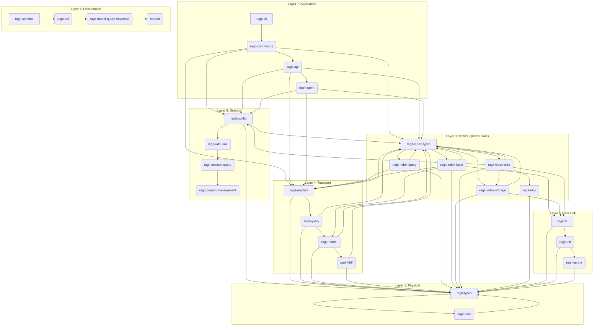

# RAGIT Index Refactoring: A Modular Architecture with OSI Layer Mapping

This document details a comprehensive refactoring plan for the monolithic `Index` struct in RAGIT. The goal is to decompose its responsibilities into distinct, specialized components, enhancing modularity, testability, and maintainability. The `Index` struct itself will evolve into a lightweight facade, coordinating interactions between these new manager objects.

## The `Index` as a Facade (Layer 3: Network - Central Addressing)

The refactored `Index` struct will no longer directly implement all logic. Instead, it will act as a coordinator or facade, holding instances of specialized manager objects that encapsulate specific functionalities. This design promotes a clear separation of concerns.

```rust
// Simplified representation of the future Index struct
// Resides in `crates/ragit-index-types`
pub struct Index {
    // Core state and metadata
    pub core_state: IndexCoreState, // A new struct for core data

    // Manager instances (delegated responsibilities)
    pub config_manager: ConfigManager,
    pub storage_manager: StorageManager,
    pub search_engine: SearchEngine,
    pub build_orchestrator: BuildOrchestrator,
    pub recovery_manager: RecoveryManager,
    // ... other fields as needed
}
```

## Proposed Manager Components & Crate Mapping with OSI Layers

Here's a breakdown of the `Index`'s responsibilities, mapped to new or existing manager components and their corresponding crates, along with their conceptual OSI layer assignments.

### 1. `IndexCoreState` (Data Structure)
*   **Responsibility:** Holds the fundamental state and metadata of the index (e.g., `ragit_version`, `chunk_count`, `staged_files`, `processed_files`, `ii_status`, `uid`, `summary`).
*   **OSI Layer:** Layer 3 (Network) - Represents the core addressing and state of the index's internal network of data.
*   **Crate:** `ragit-index-types` (where the `Index` struct itself and its core data will reside).

### 2. `ConfigManager` (Logic)
*   **Responsibility:** Handles all configuration-related logic (loading, saving, getting/setting values for `BuildConfig`, `QueryConfig`, `ApiConfig`, prompts, models).
*   **OSI Layer:** Layer 5 (Session) - Manages the session-level configuration and settings for interactions.
*   **Crate:** `ragit-config` (already exists and is the natural home for this logic). It will depend on `ragit-types` for the config data structures.

### 3. `StorageManager` (Logic)
*   **Responsibility:** Manages all file system interactions specific to the index's internal structure (e.g., `get_rag_path`, `get_chunk_by_uid`, managing chunk files, inverted index files).
*   **OSI Layer:** Layer 3 (Network) - Responsible for routing and addressing data within the index's storage network.
*   **Crate:** A new crate, `ragit-index-storage`. It will depend on `ragit-fs` (for general file system operations) and `ragit-types` (for UIDs, Chunk structures).

### 4. `SearchEngine` (Logic)
*   **Responsibility:** Encapsulates all search functionality, including TF-IDF calculations, inverted index queries, and chunk retrieval based on search results.
*   **OSI Layer:** Layer 3 (Network) - Facilitates the discovery and retrieval of data across the index's "network" of information.
*   **Crate:** `ragit-index-query` (already exists and can orchestrate this). It will depend on `ragit-tfidf` (for TF-IDF logic), `ragit-query` (for general query execution), and `ragit-types` (for `Chunk`, `TfidfResult`, etc.).

### 5. `BuildOrchestrator` (Logic)
*   **Responsibility:** Coordinates the complex process of building the index, including file processing, chunking, summary generation, and updating the index state.
*   **OSI Layer:** Layer 3 (Network) - Manages the flow and construction of the index's data "network."
*   **Crate:** A new crate, `ragit-index-build`. It will depend on `ragit-types`, `ragit-fs`, `ragit-readers` (for reading file content), and `ragit-model` (for LLM interactions).

### 6. `RecoveryManager` (Logic)
*   **Responsibility:** Handles error recovery, validation, and integrity checking of the index state.
*   **OSI Layer:** Layer 3 (Network) - Ensures the integrity and reliability of the index's data "network."
*   **Crate:** `ragit-index-core` (This crate will house core index logic, including recovery). It will depend on `ragit-types` and `ragit-fs`.

## OSI Layer Mapping for RAGIT Crates (Refined)

This section provides a refined mapping of RAGIT crates to the OSI model, illustrating their conceptual roles and dependencies.

*   **Layer 7 (Application):** User-facing applications and commands.
    *   `ragit-cli`, `ragit-commands`, `ragit-api`, `ragit-agent`
*   **Layer 6 (Presentation):** Data formatting, schema definition, and prompt language.
    *   `ragit-schema`, `ragit-pdl`, `ragit-model-query-response`, `korean`
*   **Layer 5 (Session):** Session management, configuration, rate limiting, and high-level query orchestration.
    *   `ragit-config`, `ragit-rate-limit`, `ragit-session-query`, `ragit-prompt-management`
*   **Layer 4 (Transport):** Reliable data transfer, core query execution, and data readers.
    *   `ragit-readers`, `ragit-query`, `ragit-model`, `ragit-tfidf`
*   **Layer 3 (Network):** Routing, addressing, indexing, and core utilities. This layer is central to the `Index`'s operation.
    *   `ragit-index-types` (Index struct, core data), `ragit-index-query`, `ragit-index-build` (new), `ragit-index-storage` (new), `ragit-index-core` (for recovery/core logic), `ragit-utils`
*   **Layer 2 (Data Link):** Error detection/correction, physical addressing, file system abstraction, and UID management.
    *   `ragit-fs`, `ragit-uid`, `ragit-ignore`
*   **Layer 1 (Physical):** Raw data representation, fundamental types, and basic utilities.
    *   `ragit-types` (pure data types), `ragit-core` (fundamental traits)

## Visualizing Dependencies and OSI Layers


